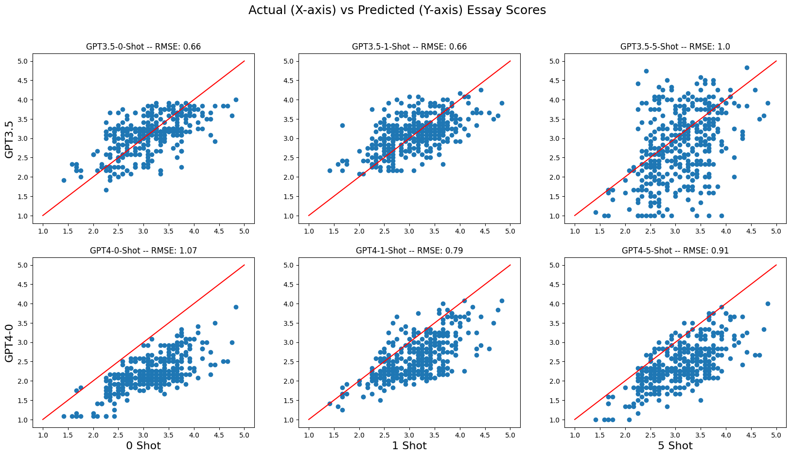

# Essay-Scoring -- DebertaV3 vs. ChatGPT

## Background and Motivation
This work is based on a Kaggle competition to develop a method to automatically score essays written by English language learners in 8th through 12th grade. Using AI models for automated scoring would help increase feedback for students and provide support for teachers.

https://www.kaggle.com/competitions/feedback-prize-english-language-learning 

Essay scoring consisted of 6 categories: cohesion, convention, grammar, phraseology, syntax and vocabulary.
Each category is scored from 1 to 5 on 0.5 level increments.

In this study two main approaches were compared:

* **Fine-Tuning:** A small, pre-trained model of 86M parameters (DebertaV3) was fine-tuned to evaluate the essays.
* **Prompt Engineering:** Using both ChatGPT 3.5 and 4 the model was prompted to score the given essays.

Below are key results from the study.

## Data

3911 essays were split into 80% Train, 10% Validation and 10% Test datasets.

The overall distribution of average scores were centered around a mean of 3.1 . Based on the distribution a very significant class imbalance exists with most of the scores centered around the mean.

  
       
One potential concern with using DebertaV3-base for fine-tuning was a max input token length of 768. This means approximately 10% of essays are be truncated during training. Comparing the populations of scores for essays above and below this limit the average increases from 3.1 for not truncated to 3.3 for truncated. Although small a t-test shows this change to be significant and a model with a larger input window should be evaluated for future work.


## Fine-Tuning (DebertaV3-base)

Fine-tuning was primarily performed using the same hyperparameters as Microsoft's DebertaV3 paper https://arxiv.org/abs/2111.09543. 

One significant deviation is the use of layerwise rate decay was explored to assist with transfer learning for the essay grading task. Layerwise rate decay gives large, aggresive learning rates for the final layers of the model while using smaller, more conservative learning rates for the base layers. This approach allows the model to learn from the fine-tuning dataset while preserving the basic causal language modeling skills learned during pre-training.


Introducing layerwise learning rate decay made it necessary to shift the initial learning rates higher. Overall the best combination of results came from an initial learning rate of 0.03 and layerwise decay rate of 0.1 . 

Training and Validation results from this run show very little overfitting and a decrease in validation loss over 10 epochs. Future study could be done to see if training for longer epochs can improve results further. 10 epochs was chosen as the initial hyperparameters show a significant amount of overfitting by this point and to reduce overall GPU usage for training.


### Fine-Tuning Results
Final performance was evaluated on the holdout test set. The model was able to achieve a strong correlation between actual and predicted scores. An RMSE value of 0.50 on the test set outperforms any of the GPT model variations (shown below).


## Prompting (GPT-3.5, GPT-4)

Another approach that was evaluated was using existing API's for OpenAI's GPT-3.5 and GPT-4 models (gpt-3.5-turbo-11-6 and gpt-4-1106-preview). Models were prompted in the following fashion:

* 0-shot: No example essays were given to the model. The model was prompted to evaluate the given essays using the desired scoring ruberic.
* 1-shot: 1 example essay was given to the model. The model was prompted to evaluate the given essays using the desired scoring ruberic.
* 5-shot: 5 example essays were given to the model. The model was prompted

**Example 1-shot prompt:**

Score the following essay in these categories: cohesion, syntax, vocabulary, phraseology, grammar, conventions. Return only a JSON object with category scores between 1.0 and 5.0 is 0.5 increments. Do not include newlines or any other characters. Here is an example essay surrounded by triple backticks followed by scores: \```[Example Essay Here]\``` Score: cohesion: 4.0, syntax: 3.0, vocabulary: 3.5, phraseology: 3.5, grammar: 4.0, conventions: 3.5, . Essay for you to score surrounded by triple backticks: \```[Essay to Score Here]```

### Prompting Results



Overall the GPT models struggled to score the essays accurately. The GPT-3.5 models performed reasonable well with 0-shot and 1-shot prompts, however lost performance with 5-shot prompts. This could be due to the overall length of the prompt and losing the relative importance of the scoring ruebric vs the examples.  

The GPT-4 model performed poorly across all prompts. For 0-shot the model consitently scored essays lower than their actual score, and given examples the model improved accuracy but still scored the essays low overall. Further work could be done to improve the prompt, such as giving more information on the level of the students and expectations from the reviewers.

## Conclusion

Overall the DebertaV3 model outperformed the GPT models in scoring the essays, with a RMSE of essays scores of 0.50 vs. 0.66 for the best GPT model. The GPT models overall struggled to score the essays accurately and consistently scored essays lower than their actual score even with example essays fed into the context window. While further prompt engineering may be able to improve the GPT models, fine-tuning of small dedicated models such as DebertaV3 is a more reliable approach for scoring essays.